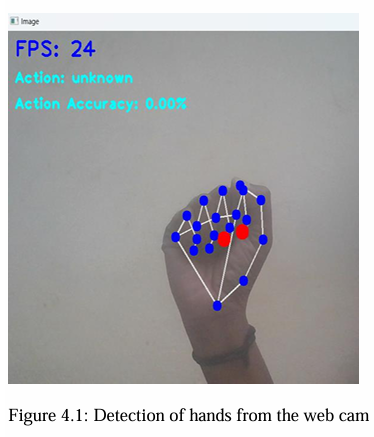
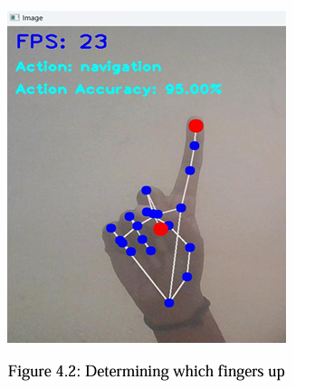
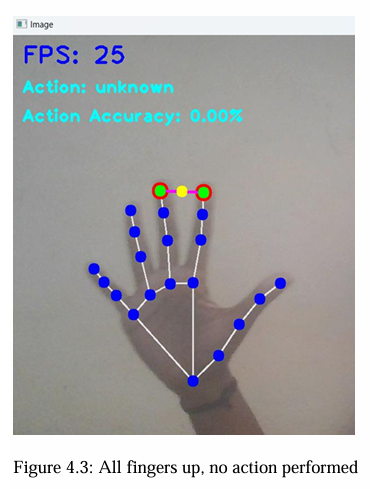
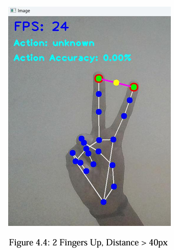
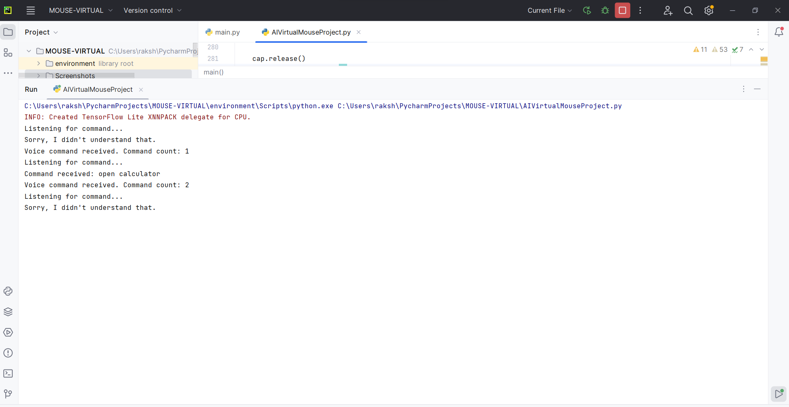
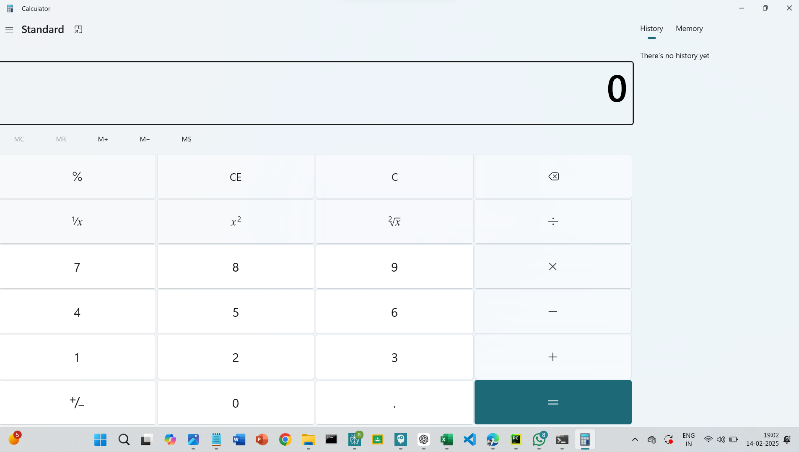

# AI Virtual Mouse

## 📌 Overview

AI Virtual Mouse is an advanced computer interaction system that allows users to control their mouse using hand gestures and voice commands. It leverages computer vision and speech recognition to create a hands-free navigation experience.

## 🚀 Features

## 🛠️ Tech Stack

- **Computer Vision:** OpenCV, MediaPipe
- **Machine Learning:** Hand tracking models
- **Voice Recognition:** SpeechRecognition, Pyttsx3
- **Automation:** PyAutoGUI, AutoPy
- **Backend:** Python

## 📊 Project Structure

```
AI_Virtual_Mouse/
│-- environment/             # Virtual environment (if used)
│-- Screenshots/             # Folder for storing screenshots
│-- AIVirtualMouseProject.py # Main script for AI Virtual Mouse
│-- main.py                  # Entry point of the project
│-- README.md                # Project documentation
│-- requirements.txt         # Dependencies

```

## 🏧 Installation & Setup

### Prerequisites

- Python (>= 3.8)
- Git
- Virtual Environment (optional but recommended)

### Steps

1. **Clone the Repository**
   ```sh
   git clone https://github.com/rakshashetty66/AI_Virtual_Mouse.git
   cd AI_Virtual_Mouse
   ```
2. **Create Virtual Environment (Optional but Recommended)**
   ```sh
   python -m venv venv
   source venv/bin/activate  # On Windows use: venv\Scripts\activate
   ```
3. **Install Dependencies**
   ```sh
   pip install -r requirements.txt
   ```
4. **Run the Application**
   ```sh
   python AIVirtualMouseProject.py
   ```
5. **Start Using the Virtual Mouse**
   - Use hand gestures to move the cursor and perform right click.
   - Speak commands like "open browser" or "volume up" to perform actions.

## 🎯 Usage

1. **Move the Cursor:** Point your index finger to control movement.
2. **Right Click:** Pinch your index and middle fingers together.
3. **Drag and Drop:** Use a three-finger pinch motion.
4. **Voice Commands:** Speak actions like "scroll up," "zoom in," or "exit."
6. **Switch Modes:** Combine voice and hand gestures for enhanced control.
---

📸 **Screenshots**  
<div style="display: flex; flex-wrap: wrap; gap: 10px; justify-content: center;">
  
  
  
  
  
  
  
  
</div>


---


## 🔮 Future Improvements

- Add AI-driven gesture learning.
- Support customizable voice commands.
- Implement additional accessibility features.
- Optimize processing speed for lower-end systems.

## 🤝 Contributing

Contributions are welcome! Fork the repo, create a new branch, and submit a pull request.

## 📝 License

This project is licensed under the MIT License.

## 📞 Contact

For any queries or suggestions, reach out to:

- **Email:** [raksharshetty46@gmail.com](mailto:your-raksharshetty46.com)
- **GitHub:** [Here.](https://github.com/rakshashetty66)
- **LinkedIN:** [Here.](https://www.linkedin.com/in/rshetty64/)
---

🚀 **Control your computer with AI-powered hand gestures and voice commands!**
